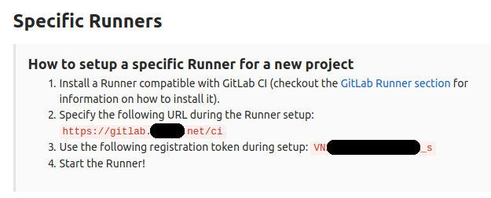
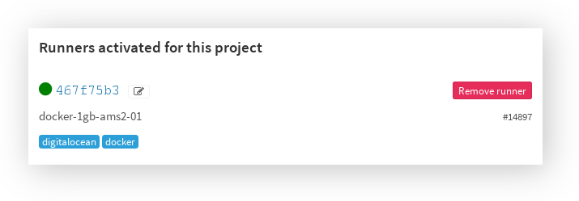

## Register the GitLab Runner

Registering a Runner is the process of tying it with a specific GitLab project. Each project on GitLab has a unique token that is used by the Runner in order to be able to talk to GitLab via its API.

When we installed GitLab Runner in the previous step, we installed GitLab Runner the service. Each GitLab Runner service can spawn as many Runner processes you want, so you can eventually register multiple Runners in a single droplet, each of which can be tied to a separate project.

To register a Runner we first need to know the project's token. Go to your newly created project or pick one that already uses GitLab.com's shared Runners. Navigate to the project's Settings > Runners and notice that the shared Runners are enabled. In the left side you get detailed information on the steps needed to register a new Runner.

Excellent! We're now ready to start using it.



Now, let's get back to the droplet and start registering a Runner:

```
$ gitlab-ci-multi-runner register
```

The command above is interactive, so you will be asked the information needed to register a new Runner.

- **the gitlab-ci coordinator URL**: e.g `https://gitlab.your.domain/ci`.
- **the gitlab-ci token for this runner**: The token in the previous image.
- **the gitlab-ci description for this runner**: eg `ci-runner-01`
- **the gitlab-ci tags for this runner**: You can use tags in your .gitlab-ci.yml to limit jobs to specific Runners.
- **the gitlab-ci tags and whether it can run untagged jobs** :`true`
- **the gitlab-ci to lock Runner to current project**: `false`
- **enter the executor**: Our executor will be docker.
- **enter the default Docker image**: `dockerphp/gitlab-ci-pipeline:7.1` The default Docker image that will be used if you don't specify it in .gitlab-ci.yml.

Once answered all questions, you can verify that the Runner is registered with:

```
$ gitlab-ci-multi-runner list
```

Now if you head back in your project's Settings > Runners you will see that the Runner appeared in the list.



You can now start using this specific Runner for your project and you may disable the shared Runners.

When you register a Runner via the gitlab-ci-multi-runner register command, the answers you give get written in the Runner's configuration file, which is located at /etc/gitlab-runner/config.toml. If we open this file after we registered the above Runner, here's what we see:

```yaml
concurrent = 1

[[runners]]
  name = "ci-runner-01"
  url = "https://gitlab.your.domain/ci"
  token = "2af00cb10f5c7a7613ae36d57d6cea"
  executor = "docker"
  [runners.docker]
    tls_verify = false
    image = "dockerphp/gitlab-ci-pipeline:7.1"
    privileged = false
    disable_cache = false
    volumes = ["/cache"]
  [runners.cache]
    Insecure = false
```

You can read all about config.toml in the official documentation.

### Update the GitLab Runner

Updating the GitLab Runner is as easy as updating your Ubuntu system:

```bash
$ apt-get update
$ apt-get install gitlab-ci-multi-runner
```

### Unregistered useless runners

To unregistered unused runners:

```bash
$ gitlab-ci-multi-runner verify --delete
```
